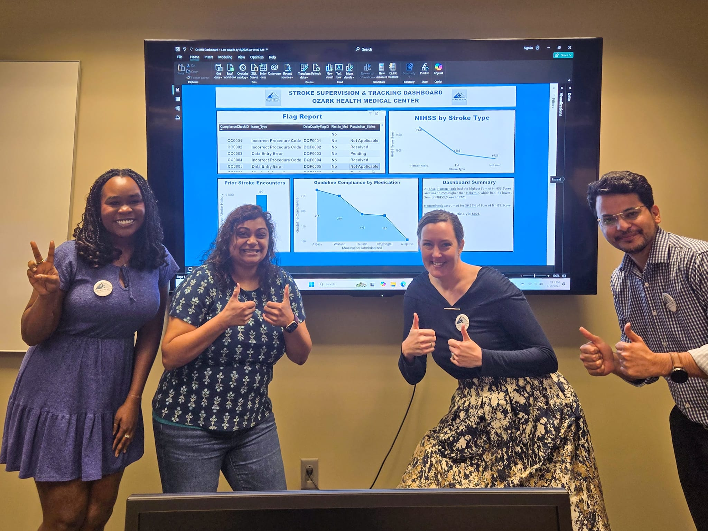

# Stroke Supervision & Tracking Database

## Project Overview
This project was developed as an elective final project for HI 2451: Database Design & Big Data Analytics at the University of Pittsburgh. The goal was to design and implement a centralized stroke supervision and tracking system to support timely clinical decision-making, guideline compliance monitoring, and quality improvement initiatives in a hospital setting.

The system was modeled for a regional medical center specializing in neurology and rehabilitation and focuses on improving data consistency, real-time visibility, and cross-departmental coordination for stroke encounters.

## Tools & Technologies
- SQL Server (SSMS) – centralized relational database
- Microsoft Access – data entry interface and query development
- Power BI – reporting and dashboard visualization
- Role-based access control, encryption at rest (TDE), and secure data transfer (SSL/TLS)
- Synthetic data generation (ChatGPT)

## System Design
The database supports:
- Longitudinal tracking of patients and stroke encounters
- Clinical snapshot data at the time of encounter (e.g., BMI, glucose)
- Treatment documentation
- Guideline compliance checks
- Data quality flagging for audit and reporting purposes

SQL Server served as the centralized relational database. Microsoft Access was used for data entry and query execution, while Power BI provided interactive dashboards for compliance monitoring and trend analysis.

## Data Source & Preparation
The dataset used in this project was fictitious and generated using AI to simulate realistic stroke encounters while avoiding the use of real patient data or PHI. Data cleaning and preprocessing were performed to ensure relational integrity and compatibility across SQL Server, Access, and Power BI.

## Dashboard & Visualization

## My Role & Contributions
- Generated a synthetic stroke dataset using ChatGPT
- Cleaned and preprocessed data for SQL ingestion
- Collaborated on SQL schema development and queries
- Worked with a teammate to connect SQL Server to Power BI
- Contributed to documentation and final project presentation

## Key Outcomes
- Designed a relational database supporting stroke encounter tracking
- Built SQL queries for compliance and encounter reporting
- Developed a Power BI dashboard for clinical and quality insights
- Successfully integrated unfamiliar tools under time constraints

## Limitations & Future Enhancements
- Scalability limitations of Microsoft Access
- No direct EHR integration
- Future work could include automated EHR ingestion and web-based interfaces
## Limitations & Future Work
- Scalability constraints of Microsoft Access for high-volume data
- Lack of direct EHR integration
- Opportunities for automation, audit logging, and web-based deployment

Future iterations could integrate EHR data feeds, migrate the interface to a web application, and support accreditation and regulatory reporting needs.

## Team
 
- Grace Okoro  
- Supriya Plumley
- Ashley DeNoyer  
- Syed Sajjad Ali

## Acknowledgments
Developed as part of HI 2451: Database Design & Big Data Analytics  
University of Pittsburgh
